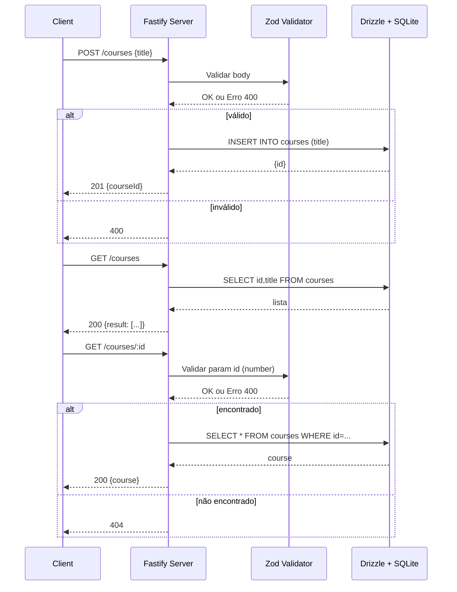

# Desafio Node.js – Primeira API (aulas)

API simples em Node.js + TypeScript usando Fastify, Drizzle ORM (SQLite) e Zod. Inclui documentação Swagger/Scalar em ambiente de desenvolvimento.

## Requisitos
- Node.js 20.12.2+ (recomendado usar .nvmrc)
- npm (ou outro gerenciador, mas o projeto usa `package-lock.json`)

## Tecnologias
- **Fastify 5** - Framework web rápido e eficiente
- **TypeScript** - Superset do JavaScript com tipagem estática
- **Drizzle ORM + SQLite** - ORM moderno e type-safe com banco embarcado
- **Zod** - Validação de dados
- **Swagger/OpenAPI + Scalar API Reference** (em `/docs` quando `NODE_ENV=development`)
- **tsx** - Executor TypeScript para desenvolvimento
- **pino-pretty** - Logger formatado para desenvolvimento

## Configuração
1. Clone o repositório e acesse a pasta do projeto.
2. Instale as dependências:
```bash
npm install
```
3. Crie um arquivo `.env` na raiz com:
```bash
# Ativa docs em /docs
NODE_ENV=development
```
4. Configure o banco de dados SQLite:
```bash
# Opção 1: Setup completo (gerar + aplicar migrações)
npm run db:setup

# Opção 2: Passo a passo
npm run migrate:generate  # Gera arquivo SQL de migração
npm run migrate          # Aplica migrações no banco
```

5. (Opcional) Popular banco de dados com dados de exemplo:
```bash
# Seed completo (usuários + cursos + matrículas)
# Padrão: 5 usuários, 20 cursos, 3 matrículas por usuário
npm run db:seed

# Seed completo com quantidades customizadas
npm run db:seed -- --users=10 --courses=8 --enrollments=4

# Seeds individuais (caso prefira popular separadamente)
npm run db:seed-users       # Padrão: 2 usuários
npm run db:seed-users 10    # Criar 10 usuários
npm run db:seed-courses     # Padrão: todos os 20 cursos
npm run db:seed-courses 5   # Criar apenas 5 cursos
```

6. (Opcional) Para inspecionar o schema/estado com o Drizzle Studio:
```bash
npm run drizzle:studio
```

## Executando o servidor
```bash
npm run dev
```
- Porta padrão: `http://localhost:3333`
- Logs legíveis habilitados
- Documentação da API (em dev): `http://localhost:3333/docs`

## Endpoints
Base URL: `http://localhost:3333`

- **POST `/courses`**
  - Cria um curso
  - Body (JSON):
    ```json
    { "title": "Curso de Docker" }
    ```
  - Respostas:
    - 201: `{ "courseId": 1 }`

- **GET `/courses`**
  - Lista todos os cursos
  - 200: `{ "result": [{ "id": 1, "title": "..." }], "total": 1 }`

- **GET `/courses/:id`**
  - Busca um curso pelo ID
  - Parâmetros: `id` (number)
  - Respostas:
    - 200: `{ "course": { "id": 1, "title": "...", "description": "... | null" } }`
    - 404: vazio

Há um arquivo `requisicoes.http` com exemplos prontos (compatível com extensões de REST Client).

## Estrutura do Projeto
```
api-node/
├── docs/                 # Documentação técnica (local)
│   ├── README.md         # Visão geral da documentação
│   ├── instrucoes.md     # Instruções de setup
│   ├── migracoes-drizzle.md  # Guia de migrações
│   └── drizzle-studio-setup.md  # Configuração do Studio
├── drizzle/              # Migrações do banco de dados
├── src/
│   ├── database/         # Schema e cliente do banco
│   │   ├── schema.ts     # Definição das tabelas
│   │   ├── client.ts     # Cliente SQLite
│   │   └── dev.db        # Arquivo do banco SQLite
│   ├── requests/         # Arquivos de requisições HTTP
│   │   └── requisicoes.http  # Exemplos de requisições
│   └── scripts/          # Scripts utilitários
│       ├── apply-migration.js  # Aplicar migrações
│       └── check-db.js          # Verificar banco
├── .claude/              # Configurações Claude (local)
├── server.ts            # Servidor principal
├── CLAUDE.md            # Documentação Claude (local)
├── package.json         # Configurações e dependências
├── tsconfig.json        # Configuração TypeScript
├── drizzle.config.ts    # Configuração Drizzle Kit
└── README.md           # Este arquivo
```

> **Nota:** Os diretórios `docs/`, `.claude/` e o arquivo `CLAUDE.md` são locais e não são versionados no Git.

## Modelos (schema)
Tabelas principais definidas em `src/database/schema.ts`:
- **`courses`**
  - `id` (integer, pk, auto-increment)
  - `title` (text, único, obrigatório)
  - `description` (text, opcional)
  - `created_at` (timestamp, obrigatório)
  - `updated_at` (timestamp, obrigatório)
- **`users`** (exemplo para estudos)
  - `id` (integer, pk, auto-increment)
  - `first_name` (text, obrigatório)
  - `last_name` (text, obrigatório)
  - `email` (text, único, obrigatório)

## Scripts

### Desenvolvimento
- `npm run dev`: inicia o servidor com reload e carrega variáveis de `.env`
- `npm run drizzle:studio`: abre o Drizzle Studio

### Migrações
- `npm run migrate:generate`: gera artefatos do Drizzle a partir do schema
- `npm run migrate`: aplica migrações no banco
- `npm run db:setup`: configura o banco de dados (gera e aplica migrações)
- `npm run db:reset`: **DELETA** o banco SQLite e recria do zero
- `npm run db:check`: verifica o status do banco SQLite

### Seeds (Popular dados)
- `npm run db:seed`: executa seed completo (usuários + cursos + matrículas)
  - Padrão: 5 usuários, 20 cursos, 3 matrículas/usuário
  - Com parâmetros: `npm run db:seed -- --users=10 --courses=8 --enrollments=4`
  - **Algoritmo de matrículas**: Cada usuário é matriculado em N cursos **aleatórios** sem repetição
    - Exemplo: 3 usuários, 5 cursos, 2 matrículas/usuário = 6 matrículas totais
    - User 1 → sorteados: Course A, Course D
    - User 2 → sorteados: Course B, Course E
    - User 3 → sorteados: Course C, Course A
- `npm run db:seed-users [quantidade]`: cria apenas usuários (padrão: 2)
- `npm run db:seed-courses [limite]`: cria apenas cursos (padrão: todos os 20)

### Resetar Tabelas (limpa dados, mantém estrutura, reseta IDs)
> **Importante:** Estes comandos **apagam todos os registros** da tabela e **resetam os IDs autoincrementais para 1**.

- `npm run db:reset-table [nome]`: reseta tabela específica (users, courses ou enrollments)
- `npm run db:reset-users`: limpa apenas a tabela `users`
- `npm run db:reset-courses`: limpa apenas a tabela `courses`
- `npm run db:reset-enrollments`: limpa apenas a tabela `enrollments`
- `npm run db:reset-all-tables`: limpa TODAS as tabelas (mantém estrutura do banco)

**Exemplo de uso:**
```bash
# Cenário: Você tem cursos com IDs 5, 6, 7 e quer recomeçar do ID 1
npm run db:reset-courses    # Limpa tabela courses
npm run db:seed-courses 3   # Cria 3 cursos com IDs 1, 2, 3
```

## Fluxo principal (Mermaid)



## Dicas e solução de problemas

### Problema: Banco de dados não criado ou vazio
**Solução:**
```bash
# 1. Verificar status do banco
npm run db:check

# 2. Se o banco estiver vazio ou corrompido, execute:
npm run db:reset

# 3. Popular com dados de exemplo
npm run db:seed -- --users=5 --courses=10 --enrollments=3
```

### Problema: Migrações ausentes (pasta drizzle/ vazia)
**Solução:**
```bash
# 1. Regenerar migrações
npm run migrate:generate

# 2. Aplicar migrações
npm run migrate

# 3. Verificar se funcionou
npm run db:check
```

### Problema: Preciso limpar dados de teste mas manter a estrutura
**Solução:**
```bash
# Resetar uma tabela específica (apaga dados e reseta IDs)
npm run db:reset-courses
npm run db:reset-users

# Resetar TODAS as tabelas (mantém estrutura do banco)
npm run db:reset-all-tables

# Popular novamente com dados limpos
npm run db:seed -- --users=5 --courses=10 --enrollments=3
```

### Diferença entre comandos de reset
- **`npm run db:reset`**: DELETA o arquivo do banco e recria tudo do zero (estrutura + dados)
- **`npm run db:reset-table [nome]`**: Limpa apenas UMA tabela, mantém estrutura e reseta IDs para começar do 1
- **`npm run db:reset-all-tables`**: Limpa TODAS as tabelas, mas mantém a estrutura do banco

### Outros problemas comuns
- **Arquivo SQLite não encontrado**: confirme que `npm run db:setup` foi executado e que o arquivo `src/database/dev.db` existe.
- **Variável `NODE_ENV` ausente**: verifique seu `.env`. A documentação em `/docs` só aparece quando `NODE_ENV=development`.
- **Docs não aparecem em `/docs`**: garanta `NODE_ENV=development` no `.env` e reinicie o servidor.
- **Banco corrompido**: execute `npm run db:reset` para resetar o banco SQLite.
- **Erro ao popular dados**: certifique-se de que as migrações foram aplicadas antes de rodar os seeds.

## Licença
ISC (ver `package.json`).
